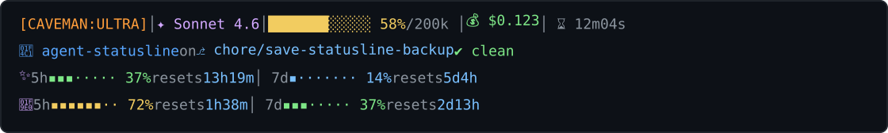

# agent-statusline

Small reference repo for a Claude Code statusline that is readable, fixed-width,
and easy to restore later. It includes two versions:

- the original Unicode-heavy statusline
- the newer ASCII-first version with ANSI color and aligned rows

This repo is meant to be copied into your own `~/.claude` setup, or used as a
reference if you want to build your own statusline from scratch.

## What’s Here

- `statusline.ascii-current.sh` - current fixed-width ASCII statusline
- `statusline.fancy-unicode.sh` - original Unicode statusline backup
- `settings.example.json` - sanitized Claude settings example

## What It Shows

The statusline is designed to keep the visible characters stable across refreshes.
That avoids the common Claude statusline problem where Unicode width and long
labels cause the percentage or quota text to render inconsistently.

The current version uses:

- ASCII-only visible text
- ANSI color for emphasis
- fixed-width bars like `[#######-----]`
- aligned quota rows for Claude and Codex
- a refresh interval so the line updates during a session

## Preview

`statusline.ascii-current.sh`

```text
[CAVEMAN:ULTRA] | Sonnet 4.6 | [#######-----]  58%/200k | $0.123 | 12m04s
[/] agent-statusline @ chore/save-statusline-backup | .
(C) 5h [###-----]  37% -> 13h19m | 7d [#-------]  14% ->   5d4h
</> 5h [######--]  72% ->  1h38m | 7d [###-----]  37% ->  2d13h
```


`statusline.fancy-unicode.sh`

```text
[CAVEMAN:ULTRA] │ ✦ Sonnet 4.6 │ ███████░░░░░ 58%/200k │ 💰 $0.123 │ ⌛ 12m04s
📁 agent-statusline on ⎇ chore/save-statusline-backup ✔ clean
✨ 5h ▪▪▪·····  37% resets 13h19m │ 7d ▪·······  14% resets   5d4h
🧠 5h ▪▪▪▪▪▪··  72% resets  1h38m │ 7d ▪▪▪·····  37% resets  2d13h
```



## Install

Copy the script you want into `~/.claude/statusline.sh` and make it executable.

```sh
cp statusline.ascii-current.sh ~/.claude/statusline.sh
chmod +x ~/.claude/statusline.sh
```

If you want the older Unicode version instead:

```sh
cp statusline.fancy-unicode.sh ~/.claude/statusline.sh
chmod +x ~/.claude/statusline.sh
```

## Claude Config

Use this in your Claude settings:

```json
{
  "statusLine": {
    "type": "command",
    "command": "bash ~/.claude/statusline.sh",
    "refreshInterval": 60
  }
}
```

The refresh interval matters because Claude may not provide rate-limit fields on
the first frame of a session.

## Restore

To switch back later, replace `~/.claude/statusline.sh` with the backup you want:

```sh
cp statusline.fancy-unicode.sh ~/.claude/statusline.sh
chmod +x ~/.claude/statusline.sh
```

or:

```sh
cp statusline.ascii-current.sh ~/.claude/statusline.sh
chmod +x ~/.claude/statusline.sh
```

## Customization

The ASCII version is intentionally conservative. If you want to tweak it:

- change the visible symbols in `statusline.ascii-current.sh`
- reorder the rows in the script
- adjust the bar width or padding
- change the ANSI colors near the top of the file

Keep the visible characters fixed-width if you care about stable rendering.

## Notes

- This repo does not contain secrets.
- The settings example is sanitized and does not include personal hooks or paths.
- The statusline command assumes Claude can execute `bash ~/.claude/statusline.sh`.
